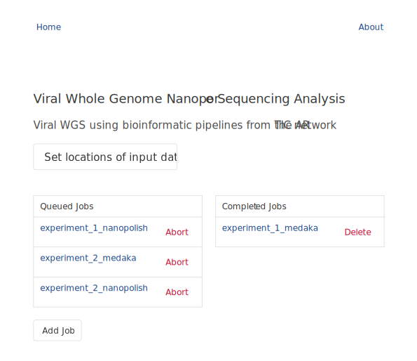
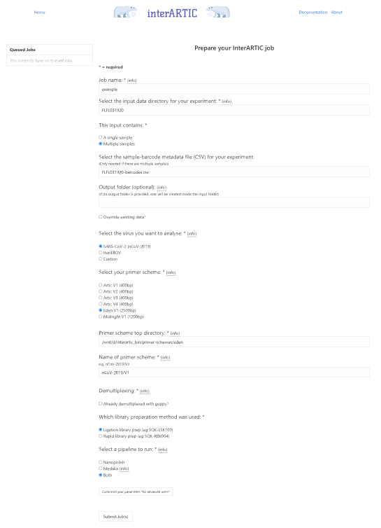

# InterARTIC

InterARTIC is an interactive web application designed to simplify the use of the [ARTIC bioinformatics pipelines](https://github.com/artic-network/artic-ncov2019) for nanopore sequencing analysis of viral genomes. InterARTIC was initally designed and tested for analysis of SARS-CoV-2, but is suitable for analysis of any virus and/or amplicon scheme, including a user's own custom amplicons. InterARTIC supports both the Nanopolish and Medaka pipeline alternatives from ARTIC, with parameter customisation enabled through a simple graphical interface.



[](https://github.com/Psy-Fer/interARTIC/releases)

#### Publication: [InterARTIC: an interactive web application for whole-genome nanopore sequencing analysis of SARS-CoV-2 and other viruses](https://doi.org/10.1093/bioinformatics/btab846)

#### Pre-print: [InterARTIC: an interactive web application for whole-genome nanopore sequencing analysis of SARS-CoV-2 and other viruses](https://www.biorxiv.org/content/10.1101/2021.04.21.440861v2)


Please cite the following when using *interARTIC* in your publications:

> James M Ferguson, Hasindu Gamaarachchi, Thanh Nguyen, Alyne Gollon, Stephanie Tong, Chiara Aquilina-Reid, Rachel Bowen-James, Ira W Deveson, InterARTIC: an interactive web application for whole-genome nanopore sequencing analysis of SARS-CoV-2 and other viruses, Bioinformatics, Volume 38, Issue 5, March 2022, Pages 1443–1446, https://doi.org/10.1093/bioinformatics/btab846

```
@article{ferguson2022interartic,
  title={InterARTIC: an interactive web application for whole-genome nanopore sequencing analysis of SARS-CoV-2 and other viruses},
  author={Ferguson, James M and Gamaarachchi, Hasindu and Nguyen, Thanh and Gollon, Alyne and Tong, Stephanie and Aquilina-Reid, Chiara and Bowen-James, Rachel and Deveson, Ira W},
  journal={Bioinformatics},
  volume={38},
  number={5},
  pages={1443--1446},
  year={2022},
  publisher={Oxford University Press}
}
```

# Quick start

A video tutorial of setting up and running InterARTIC: https://youtu.be/RCArn-xOkHg

## Step 1: Streamlined installation of InterARTIC

Pre-compiled binary releases are provided for Linux and MacOS for easy setup. The linux binaries can be run on Windows using [Windows Subsystem for Linux (WSL)](https://www.windowscentral.com/install-windows-subsystem-linux-windows-10). Download the [latest release](https://github.com/Psy-Fer/interARTIC/releases/latest) for your operating system and architecture, extract the tar ball and run the provided *run.sh* script by following the instructions below.


* Linux/Windows

  We provide a pre-compiled binary release for common Linux distributions on both _x86_64_ and _aarch64_ (_ARMv8_) architectures.

  - *x86_64*: Binaries for _x86_64_ should work on any Linux distribution as long as *GLIBC 2.17* (and basic shared libraries such as *pthreads*) or higher and `/usr/bin/env` are present. We have tested on Ubuntu (versions 14, 16, 18 and 20), CentOS, Debian, Fedora, Arch Linux, Gentoo Linux and openSUSE. These binaries are also verified to work on Windows 10 through Windows Subsystem for Linux. Open a bash terminal and execute the following commands:

    ```bash
    wget https://github.com/Psy-Fer/interARTIC/releases/download/v0.4.4/interartic-v0.4.4-linux-x86-64-binaries.tar.gz -O interartic_bin.tar.gz
    tar xf interartic_bin.tar.gz
    cd interartic_bin
    ./run.sh
    ```

  - *aarch64*: Binaries for aarch64 should work on any Linux distribution with *GLIBC 2.23* or higher. Currently, only the nanopolish pipeline is available for _aarch64_ and we have tested on Ubuntu 16 and Ubuntu 18.04 (using Rock64, Jetson Xavier and Jetson Nano single board computers).  For aarch64, run the same commands as above except the *wget* command, that should be now replaced with:

    ```
    wget https://github.com/Psy-Fer/interARTIC/releases/download/v0.4.4/interartic-v0.4.4-linux-aarch64-binaries.tar.gz -O interartic_bin.tar.gz

    ```


* macOS

  We provide a pre-compiled binary release for macOS on x86_64. Newer mac with M1 ARM chip can still run these binaries opaquely through Rosetta. Open a terminal and execute the following commands:

  ```bash
  curl https://github.com/Psy-Fer/interARTIC/releases/download/v0.4.4/interartic-v0.4.4-macos-x86-64-binaries.tar.gz -o interartic_bin.tar.gz -L
  xattr -dr com.apple.quarantine interartic_bin.tar.gz  #to prevent the macOS's gatekeeper from blocking our binaries, required if you download through a web browser, but just in case
  tar xf interartic_bin.tar.gz
  cd interartic_bin
  ./run.sh
  ```

**IMPORTANT: Make sure the interARTIC binaries reside at a location with no white space characters.**

The *run.sh* script has now launched a new interactive interARTIC session. To see your session, visit [http://127.0.0.1:5000](http://127.0.0.1:5000) on your web browser. Here, you can configure and run your next job using the graphical interface. Make sure you keep the terminal open to keep your interARTIC session running.


## Step 2: Downloading test dataset

Open a new terminal to download and extract the [example test dataset](https://seq.bioinf.science/interartic-corona). The commands below will extract the dataset to */data*, assuming */data* exists on the computer (`sudo mkdir /data`, if not) and you have write permission to */data* (`sudo chmod 777 /data`, if not). The */data* folder is the default location for sequencing outputs on an ONT GridION or PromethION device, but on your own machine you may use a custom location such as */home/username/data* if you wish (hint: you may use the `pwd` command on your terminal to get the path of your current working directory).

```bash
cd /data
wget https://seq.bioinf.science/interartic-corona -O FLFL031920_sample_data.tar.gz
#if you do not have wget: curl -o FLFL031920_sample_data.tar.gz -L https://seq.bioinf.science/interartic-corona
tar xf FLFL031920_sample_data.tar.gz
rm FLFL031920_sample_data.tar.gz
```

Once extracted, you should see two directories:
1. *FLFL031920* containing data from a nanopore sequencing run of 10 multiplexed SARS-CoV-2 isolates, performed on an ONT GridION. The *.fast5* files, *.fastq* files and the sequencing summary file are among the extracted data. This example dataset follows the same directory structure of a nanopore sequencing run with live base-calling enabled.
2. *sample-barcodes* containing a *.csv* manifest file that matches sample names to sample barcodes.

For detailed information on the input data structure and *.csv* manifest file, please visit the InterARTIC usage guide [here](https://psy-fer.github.io/interARTIC/usage/).

**IMPORTANT: Make sure the the data directory and file names do not contain white space.**

<!--
Debian
arch_linux
fedora
centos
gentoo
opensuse

https://osxdaily.com/2016/09/27/allow-apps-from-anywhere-macos-gatekeeper/

-->


## Step 3: Configuring interARTIC

Configuration is only required if you downloaded the dataset to a custom location instead of */data*.
In your interARTIC web interface, click `Set locations of input data`. Fill the first two fields (1. location of your input data, and 2. location of your sample-barcode *.csv* files are located). For example, if you used */home/username/data* the fields should be */home/username/data* and */home/username/data/sample-barcodes*, respectively.
Click `confirm` to save the settings, which will be used for all future runs.


## Step 4: Running InterARTIC on the test dataset

Click `Add Job` on the interARTIC web interface. Then fill the fields as given in the following table. Note that when you click (double click on some browsers) on fields for **input data directory** and **Select a CSV file**, a list of files/directories should appear from which you can select.

| field  | value  | description  |
|---|---|---|
| **Job name**                  | *test*    | whatever name that you like for the run (only alpha numeric characters and underscore are allowed)  |
| **input data directory**    | *FLFL031920*  | this is the directory containing the nanopore sequencing data  |
| **This input contains**       | *Multiple samples*    | our example test dataset contains 10 multiplexed samples |
| **Select a CSV file**         | *FLFL031920-barcodes.csv*  | .csv manifest file that matches sample names to sample barcodes  |
| **virus**       | *SARS-CoV-2 (nCoV-2019)*    |  |
| **Select your primer scheme**      | *Eden V1 (2500bp)*    | our example test dataset used Eden V1 primers |
| **library preparation method**     | *Ligation library prep (eg SQK-LSK109)*              | our example test dataset used ligation barcodes |
| **Select a pipeline to run**  | *Both*   | we will test both medaka and nanopolish pipelines, which will run one after the other  |

Now click `Submit job(s)` and you should see the pipeline running :)



Another example dataset containing ebola virus samples that you can use to directly test interARTIC can be downloaded from [here](https://seq.bioinf.science/interartic-ebola). The relavent options for this data set are *Multiple samples*, *ebola-barcodes.csv*, *IturiEBOV*, *Artic V1* and *Ligation library prep (eg SQK-LSK109)*.

Output data generated from interARTIC (version 0.2-beta) for the above two example data set can be downloaded for your reference from [here](https://seq.bioinf.science/interartic-testout).

# interARTIC usage

Before running interARTIC on your own nanopore samples, please refer to the detailed guide [here](https://psy-fer.github.io/interARTIC/usage/). If you want to run interARTIC on custom primer schemes or viruses, refer to the instructions [here](https://psy-fer.github.io/interARTIC/primers/)

# Troubleshooting

See [here](https://psy-fer.github.io/interARTIC/troubleshooting/) for troubleshooting common issues.


# Building from source

Building from source is not straightforward, due to the dependency hell of Python versions (circumventing this hell was one of the motivations for developing interARTIC). Step-by-step instructions for building from source are given [here](https://psy-fer.github.io/interARTIC/installation/). Any one who wants to build a docker image for interARTIC can do so by following instructions [here](https://psy-fer.github.io/interARTIC/installation/#installation-using-docker), though it is highly redundant.

# Snake Charming

Developers interested in learning how we create portable binary releases, read our packaging steps (aka the art of snake charming) detailed [here](https://psy-fer.github.io/interARTIC/snakeballing).

# Updating interARTIC

To update interARTIC to the latest version, simply delete the directory containing the old interARTIC binaries and obtain the latest version by following the same steps under setting up above.

# Acknowledgement

interARTIC is a layer built on top of the [ARTIC pipeline](https://github.com/artic-network/artic-ncov2019). Binary releases of interARTIC contain:
1. [Python 3.7 binaries](https://github.com/indygreg/python-build-standalone) (build: [cpython-3.7.7-linux64-20200409T0045](https://github.com/indygreg/python-build-standalone/releases/download/20200408/cpython-3.7.7-linux64-20200409T0045.tar.zst)) and several Python 3.7 modules available through *pypi* (e.g., [celery](https://pypi.org/project/celery/), [redis](https://pypi.org/project/redis/), [flask](https://pypi.org/project/Flask/), [redis-server](https://pypi.org/project/redis-server/))
3. [ARTIC pipeline binaries](https://bioconda.github.io/recipes/artic/README.html) available through bioconda that includes many dependencies (e.g., Python 3.6, medaka, nanopolish)
