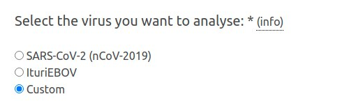

# Custom Primers

The underlying artic pipeline of InterARTIC allows a user to use any primer scheme designed for viruses, given a few rules are followed, both in formatting, and folder structure. Here we will descibe these rules, how to build the required files, and how to use them with InterARTIC.

In the examples, we use nCoV-2019 as the virus name, and it's best to be consistent with naming conventions across both folder and files. We did not write the artic pipeline, and some assumptions on naming are made in the tools. If you are using a different virus, name the files in the same manner, so `my-virus.bed`, `my-virus.scheme.bed` for example.

The following files are required for the underlying artic pipeline:

```
nCoV-2019.reference.fasta
nCoV-2019.scheme.bed
```

The folder structure should be in the form `primer-scheme/virus/version`.

Here are a few examples:

```
primer-schemes
├── artic
│   ├── nCoV-2019
│   ├── V1
│   │   ├── nCoV-2019.bed
│   │   ├── nCoV-2019.insert.bed
│   │   ├── nCoV-2019.log
│   │   ├── nCoV-2019.pdf
│   │   ├── nCoV-2019.pickle
│   │   ├── nCoV-2019.primer.bed
│   │   ├── nCoV-2019.reference.fasta
│   │   ├── nCoV-2019.reference.fasta.fai
│   │   ├── nCoV-2019.scheme.bed
│   │   ├── nCoV-2019_SMARTplex.tsv
│   │   ├── nCoV-2019.svg
│   │   └── nCoV-2019.tsv
│   ├── V2
│   │   ├── nCoV-2019.bed
│   │   ├── nCoV-2019.insert.bed
│   │   ├── nCoV-2019.primer.bed
│   │   ├── nCoV-2019.reference.fasta
│   │   ├── nCoV-2019.scheme.bed
│   │   └── nCoV-2019.tsv
│   ├── V3
│   │   ├── nCoV-2019.bed
│   │   ├── nCoV-2019.insert.bed
│   │   ├── nCoV-2019.primer.bed
│   │   ├── nCoV-2019.reference.fasta
│   │   ├── nCoV-2019.reference.fasta.fai
│   │   ├── nCoV-2019.scheme.bed
│   │   └── nCoV-2019.tsv
│   └── V4
│       ├── README
│       ├── SARS-CoV-2.design.fasta
│       ├── SARS-CoV-2.insert.bed
│       ├── SARS-CoV-2.primer.bed
│       ├── SARS-CoV-2.reference.fasta
│       └── SARS-CoV-2.scheme.bed
├── eden
│   └── nCoV-2019
│       └── V1
│           ├── nCoV-2019.reference.fasta
│           ├── nCoV-2019.reference.fasta.fai
│           ├── nCoV-2019.scheme.bed
│           └── nCoV-2019.scheme.bed.old
└── midnight
    └── nCoV-2019
        └── V1
            ├── nCoV-2019.bed
            ├── nCoV-2019.reference.fasta
            ├── nCoV-2019.reference.fasta.fai
            └── nCoV-2019.scheme.bed
```

It can be seen here, there are more files, then just the 2 required stated above. That is simply from keeping initial bed files, in the translation to the `*.scheme.bed` files, or the `*reference.fasta.fai` files which are automatically created index files from minimap2 when doing read alignment, or other intermediate files.

##### Note: Because minimap2 needs to write the `.fai` files to the same directory as the reference file, the directoy housing these files must be writable.


## \*.reference.fasta structure

The reference file is exactly that, a fasta file containing the reference genome of the target virus. In this case, with 60nt per line.

Here is the first 9 lines of the nCov-2019 (SARS-CoV-2) viral reference genome file.

```
>MN908947.3
ATTAAAGGTTTATACCTTCCCAGGTAACAAACCAACCAACTTTCGATCTCTTGTAGATCT
GTTCTCTAAACGAACTTTAAAATCTGTGTGGCTGTCACTCGGCTGCATGCTTAGTGCACT
CACGCAGTATAATTAATAACTAATTACTGTCGTTGACAGGACACGAGTAACTCGTCTATC
TTCTGCAGGCTGCTTACGGTTTCGTCCGTGTTGCAGCCGATCATCAGCACATCTAGGTTT
CGTCCGGGTGTGACCGAAAGGTAAGATGGAGAGCCTTGTCCCTGGTTTCAACGAGAAAAC
ACACGTCCAACTCAGTTTGCCTGTTTTACAGGTTCGCGACGTGCTCGTACGTGGCTTTGG
AGACTCCGTGGAGGAGGTCTTATCAGAGGCACGTCAACATCTTAAAGATGGCACTTGTGG
CTTAGTAGAAGTTGAAAAAGGCGTTTTGCCTCAACTTGAACAGCCCTATGTGTTCATCAA
```

## \*.scheme.bed structure

The primer scheme bed file should be in the following form

```
reference	start	stop	primer_name	pool
```

Here are the first 6 lines of the eden ~2500bp primer set

```
MN908947.3	31	54	nCoV-2019_1_LEFT	nCoV-2019_1
MN908947.3	2569	2592	nCoV-2019_1_RIGHT	nCoV-2019_1
MN908947.3	1876	1897	nCoV-2019_2_LEFT	nCoV-2019_2
MN908947.3	4429	4450	nCoV-2019_2_RIGHT	nCoV-2019_2
MN908947.3	4295	4321	nCoV-2019_3_LEFT	nCoV-2019_1
MN908947.3	6847	6873	nCoV-2019_3_RIGHT	nCoV-2019_1
```

Here is the first 6 lines of the midnight ~1200bp primer set

```
MN908947.3	30	54	SARSCoV2120_1_LEFT	nCoV-2019_1
MN908947.3	1205	1183	SARSCoV2120_1_RIGHT	nCoV-2019_1
MN908947.3	1100	1128	SARSCoV2120_2_LEFT	nCoV-2019_2
MN908947.3	2266	2244	SARSCoV2120_2_RIGHT	nCoV-2019_2
MN908947.3	2153	2179	SARSCoV2120_3_LEFT	nCoV-2019_1
MN908947.3	3257	3235	SARSCoV2120_3_RIGHT	nCoV-2019_1
```

Here is the first 6 lines of the artic V3 ~400bp primer set

```
MN908947.3	30	54	nCoV-2019_1_LEFT	nCoV-2019_1
MN908947.3	385	410	nCoV-2019_1_RIGHT	nCoV-2019_1
MN908947.3	320	342	nCoV-2019_2_LEFT	nCoV-2019_2
MN908947.3	704	726	nCoV-2019_2_RIGHT	nCoV-2019_2
MN908947.3	642	664	nCoV-2019_3_LEFT	nCoV-2019_1
MN908947.3	1004	1028	nCoV-2019_3_RIGHT	nCoV-2019_1
```

And here is the first 6 lines of the artic V4 ~400bp primer set
It is a little different

```
MN908947.3	25	50	SARS-CoV-2_1_LEFT	1	+
MN908947.3	408	431	SARS-CoV-2_1_RIGHT	1	-
MN908947.3	324	344	SARS-CoV-2_2_LEFT	2	+
MN908947.3	705	727	SARS-CoV-2_2_RIGHT	2	-
MN908947.3	644	666	SARS-CoV-2_3_LEFT	1	+
MN908947.3	1017	1044	SARS-CoV-2_3_RIGHT	1	-
```

The artic nomenclature has changed and they have added an extra field.

Currently it is best to design primer-schemes similar to the first 3 examples here for now.

## Why the structure and naming matter

When the primer scheme is used within the artic minion command, it is in the following form: (`...` is other commands)

```
artic minion ... --scheme-directory ~/primer-schemes/artic nCoV-2019/V1 sample-name
```

Where `nCoV-2019/V1` and  `sample-name` are positinal arguments.
As you can see, the `--scheme-directory` is the top directory, then the positional argument `nCoV-2019/V1` sets the virus and version as directory names. Thus the structure shown above, of `scheme/virus/version` needs to be in that format.

## Using custom primer scheme in InterARTIC

To use a custom primer scheme in InterARTIC, (ie, one not included in the defaults provided) first select `Custom` in the virus selection panel:




Then in the "Please enter your custom primer here:" field, ender the name of your primer-scheme (can be anything). This will be used in the output folder naming method.

Then enter the `--scheme-directory` path into the `Primer scheme directory: ` field


Then the `virus/version` info into the `Name of primer scheme:` field.

InterARTIC will take care of the rest.
